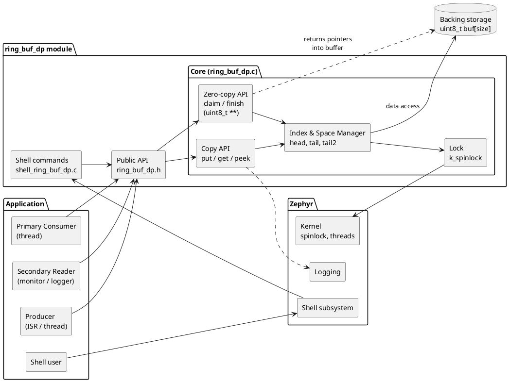
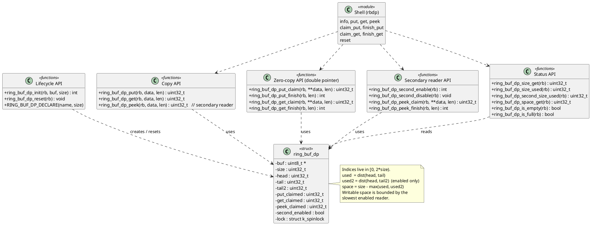
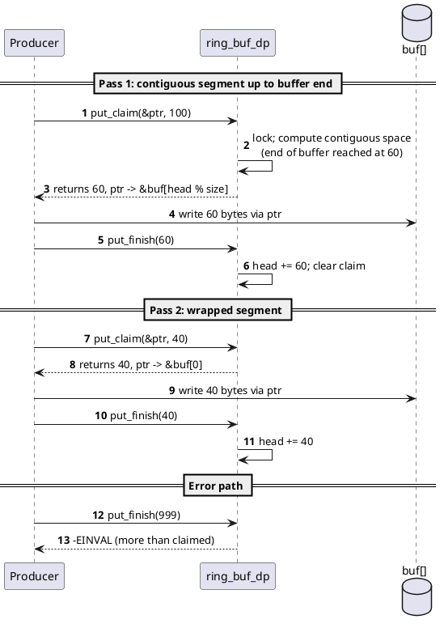
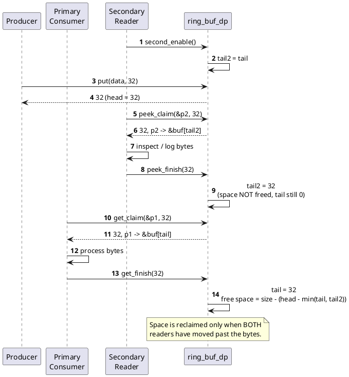
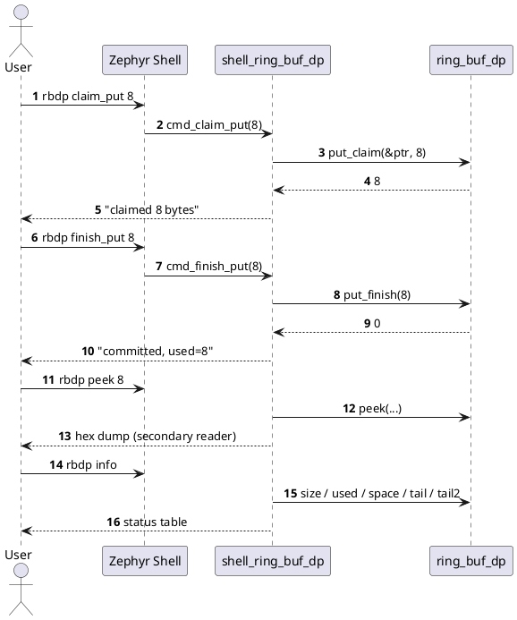

# ring_buf_dp design

`ring_buf_dp` is a byte ring buffer for Zephyr with a *double pointer* feature:

1. **Zero-copy claim/finish API.** `put_claim()`, `get_claim()` and `peek_claim()`
   hand out a `uint8_t **` that points straight into the backing storage, so a
   producer (DMA, UART ISR) or a consumer can work in place.
2. **Secondary reader.** A second, independent read pointer (`tail2`) lets a
   monitor or logger observe the same stream without stealing bytes from the
   primary consumer.

## Block diagram

## Class diagram

The C API is modelled as classes: one struct plus groups of functions that
operate on it.

## Sequence diagrams

### Zero-copy write with wrap-around

### Primary consumer and secondary reader

### Shell session

## Design rules

| Topic | Rule |
|-------|------|
| Indices | `head`, `tail`, `tail2` are kept in `[0, 2*size)`. Distance is `(a - b) mod 2*size`, the buffer offset is `idx mod size`. This distinguishes full from empty and works for any `size` up to `RING_BUF_DP_MAX_SIZE`. |
| Space | `space = size - max(used, used2)`; `used2` counts only while the secondary reader is enabled. Space is reclaimed only after both readers have passed the bytes. |
| Claims | One outstanding claim per kind (put, get, peek). A new claim supersedes an unfinished claim of the same kind. A claim returns at most the contiguous bytes up to the end of the storage, so a wrapped region needs two claim/finish passes. |
| Finish | `*_finish(len)` fails with `-EINVAL` if `len` exceeds the claimed size. Finishing less than claimed releases the remainder. |
| Copy vs claim | While a put (get / peek) claim is outstanding, `put` (`get` / `peek`) returns 0 to avoid overlapping the claimed region. |
| Secondary reader | `second_enable()` starts it at the primary tail, so it sees all unread data. `second_disable()` removes it from the space calculation. `peek*()` consume from this reader only. |
| Concurrency | All index updates are done under a `k_spinlock`, so it is safe for ISR and thread. Data is copied or written through claimed pointers outside the lock, which is safe for one producer and one consumer per pointer. |
