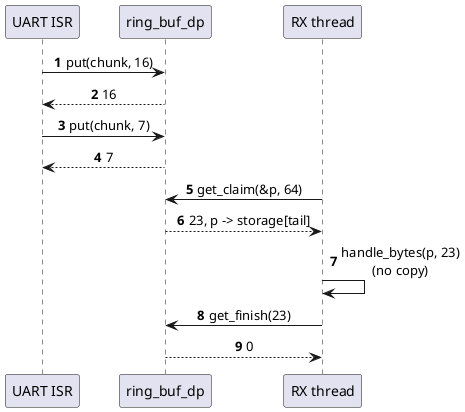
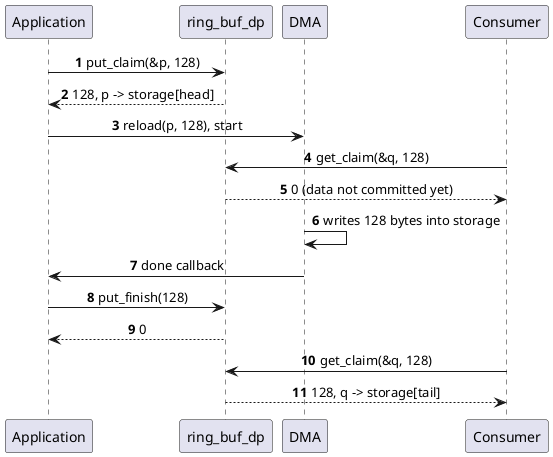
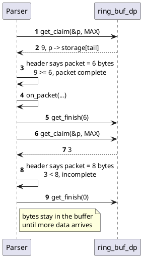
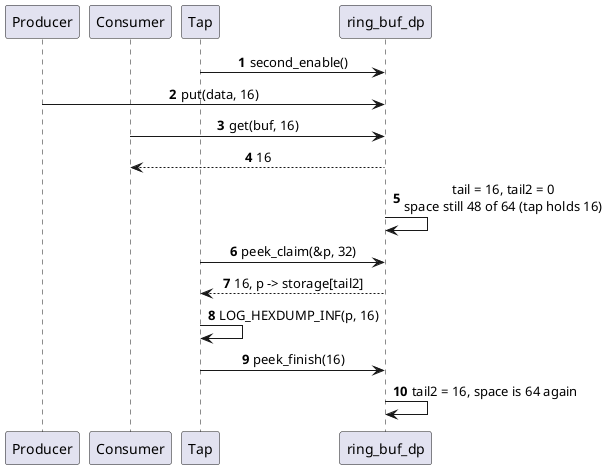
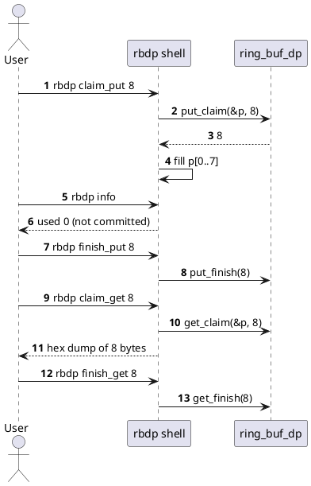

# ring_buf_dp use cases

Every example below is built from the public API in `ring_buf_dp.h`. The
complete, runnable version of the first three patterns is
`samples/basic/src/main.c`.

| # | Use case | Features used |
|---|----------|---------------|
| 1 | UART RX interrupt to thread | `put`, `get_claim`, `get_finish` |
| 2 | DMA fills the buffer directly | `put_claim`, `put_finish` |
| 3 | Packet framing without copying | `get_claim`, partial `get_finish`, wrap fallback |
| 4 | Logger tap on the same stream | secondary reader, `peek_claim`, `peek_finish` |
| 5 | Writing across the wrap point | two-pass `put_claim` loop |
| 6 | Poking the buffer from the shell | `rbdp` commands |

## UART RX interrupt to thread

The ISR copies each received byte with `put()`. A thread consumes the data in
place, so the payload is never copied a second time.

```c
RING_BUF_DP_DECLARE(rx_rb, 256);

static void uart_cb(const struct device *dev, void *user)
{
	uint8_t chunk[16];
	int n;

	while (uart_irq_update(dev) && uart_irq_rx_ready(dev)) {
		n = uart_fifo_read(dev, chunk, sizeof(chunk));
		if (ring_buf_dp_put(&rx_rb, chunk, n) < n) {
			rx_overruns++;
		}
	}
}

static void rx_thread(void *a, void *b, void *c)
{
	uint8_t *p;

	for (;;) {
		uint32_t n = ring_buf_dp_get_claim(&rx_rb, &p, 64);

		if (n == 0U) {
			k_msleep(1);
			continue;
		}
		handle_bytes(p, n);
		ring_buf_dp_get_finish(&rx_rb, n);
	}
}
```



## DMA fills the buffer directly

`put_claim()` returns a pointer the DMA controller can write to. Data becomes
visible to the reader only at `put_finish()`, once the transfer is complete.

```c
RING_BUF_DP_DECLARE(adc_rb, 1024);

static void start_dma(void)
{
	uint8_t *p;
	uint32_t n = ring_buf_dp_put_claim(&adc_rb, &p, 128);

	if (n == 0U) {
		dropped_blocks++;
		return;
	}
	dma_target = p;
	dma_claimed = n;
	dma_reload(dma_dev, channel, (uint32_t)p, n);
	dma_start(dma_dev, channel);
}

static void dma_done_cb(const struct device *dev, void *user, uint32_t ch, int status)
{
	ring_buf_dp_put_finish(&adc_rb, status == 0 ? dma_claimed : 0);
	start_dma();
}
```



A failed transfer calls `put_finish(0)`, which discards the claim without
committing anything.

## Packet framing without copying

The reader inspects the data through a claim and commits only complete
packets. `get_finish(0)` leaves the data in place, so partial packets simply
wait for more bytes.

```c
struct hdr { uint8_t len; uint8_t type; };

static void parse(void)
{
	uint8_t *p;

	for (;;) {
		uint32_t n = ring_buf_dp_get_claim(&rb, &p, UINT32_MAX);
		const struct hdr *h = (const struct hdr *)p;

		if (n < sizeof(*h) || n < sizeof(*h) + h->len) {
			ring_buf_dp_get_finish(&rb, 0);
			return;
		}
		on_packet(h->type, p + sizeof(*h), h->len);
		ring_buf_dp_get_finish(&rb, sizeof(*h) + h->len);
	}
}
```

`get_finish(0)` also matters because the copying `get()` is rejected while a
get claim is outstanding.

A claim stops at the end of the storage. When a packet straddles that point,
the claim is shorter than the packet even though all its bytes are available.
Release the claim and fall back to the copying API for that one packet:

```c
if (n >= sizeof(*h) && n < sizeof(*h) + h->len &&
    ring_buf_dp_size_used(&rb) >= sizeof(*h) + h->len) {
	uint8_t tmp[MAX_PACKET];
	uint8_t len = h->len;

	ring_buf_dp_get_finish(&rb, 0);
	ring_buf_dp_get(&rb, tmp, sizeof(struct hdr) + len);
	on_packet(tmp[1], tmp + sizeof(struct hdr), len);
}
```



## Logger tap on the same stream

A diagnostic thread enables the secondary reader to watch the data flowing to
the main consumer. It cannot steal or delay bytes from the consumer, but while
it is enabled the writer is limited by the slowest of the two readers.

```c
static void tap_thread(void *a, void *b, void *c)
{
	uint8_t *p;

	ring_buf_dp_second_enable(&rb);
	for (;;) {
		uint32_t n = ring_buf_dp_peek_claim(&rb, &p, 32);

		if (n == 0U) {
			k_msleep(10);
			continue;
		}
		LOG_HEXDUMP_INF(p, n, "stream");
		ring_buf_dp_peek_finish(&rb, n);
	}
}
```



Call `ring_buf_dp_second_disable()` when the tap is no longer needed;
otherwise a stalled tap eventually blocks the producer.

## Writing across the wrap point

A claim never wraps. When the free space spans the end of the storage, the
first claim returns the part up to the end and the second claim returns the
part at the start.

```c
static void write_all(const uint8_t *src, uint32_t len)
{
	uint8_t *p;

	while (len != 0U) {
		uint32_t n = ring_buf_dp_put_claim(&rb, &p, len);

		if (n == 0U) {
			k_msleep(1);
			continue;
		}
		memcpy(p, src, n);
		ring_buf_dp_put_finish(&rb, n);
		src += n;
		len -= n;
	}
}
```

The sequence for a 100-byte write with 60 bytes left before the end is the
"Zero-copy write with wrap-around" diagram in [design.md](design.md).

## Poking the buffer from the shell

With `CONFIG_RING_BUF_DP_SHELL=y` the `rbdp` command works on a built-in demo
buffer, which is handy for trying the semantics by hand.

```text
uart:~$ rbdp put hello
put 5 of 5 bytes
uart:~$ rbdp second on
secondary reader enabled
uart:~$ rbdp get 3
got 3 bytes
00000000: 68 65 6c                                         |hel              |
uart:~$ rbdp info
size    : 64
used    : 2
second  : 5 (on)
space   : 59
empty   : no
full    : no
uart:~$ rbdp peek 5
peeked 5 bytes
00000000: 68 65 6c 6c 6f                                   |hello            |
uart:~$ rbdp info
size    : 64
used    : 2
second  : 0 (on)
space   : 62
empty   : no
full    : no
```


